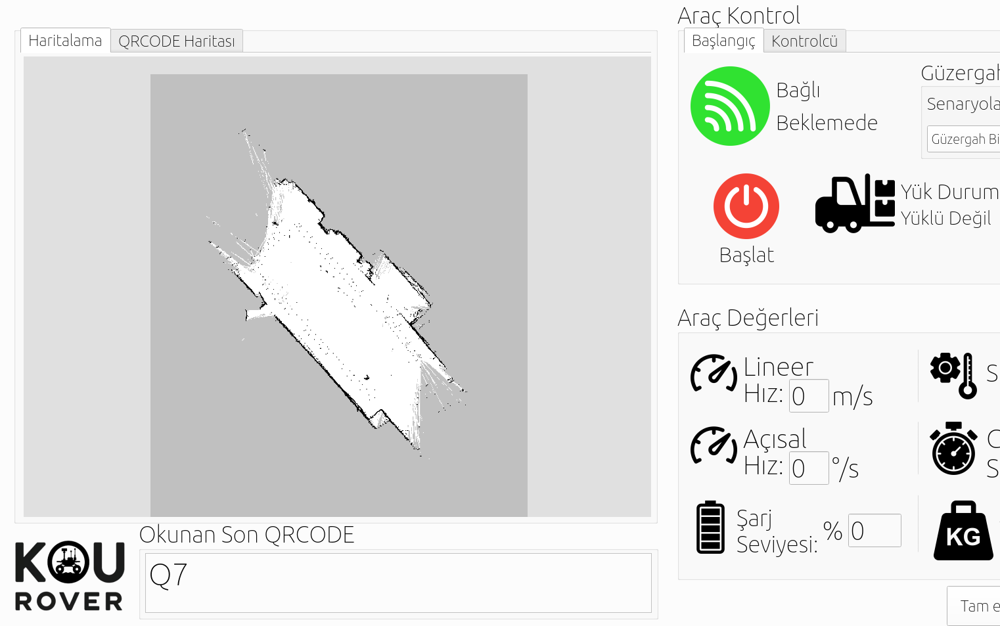
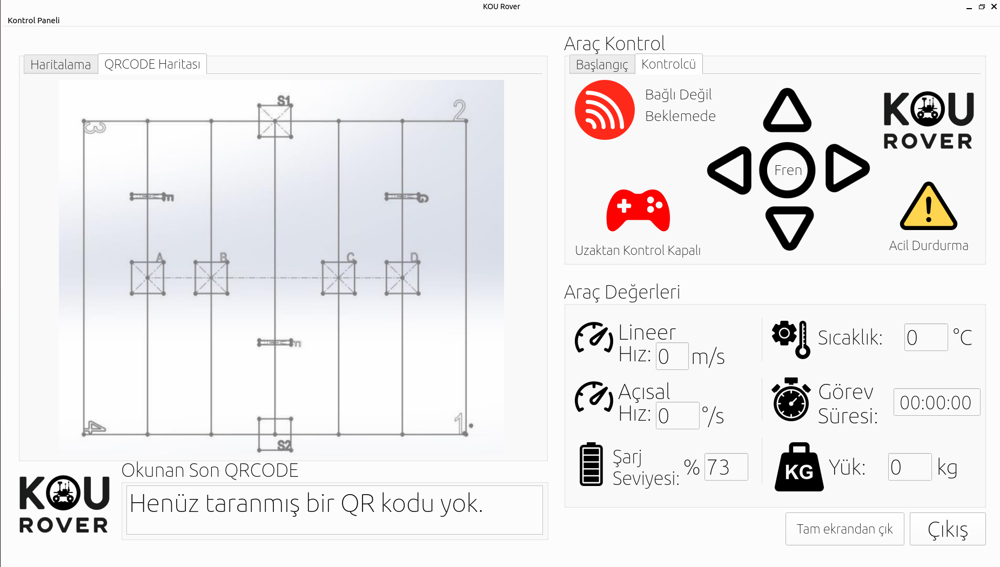
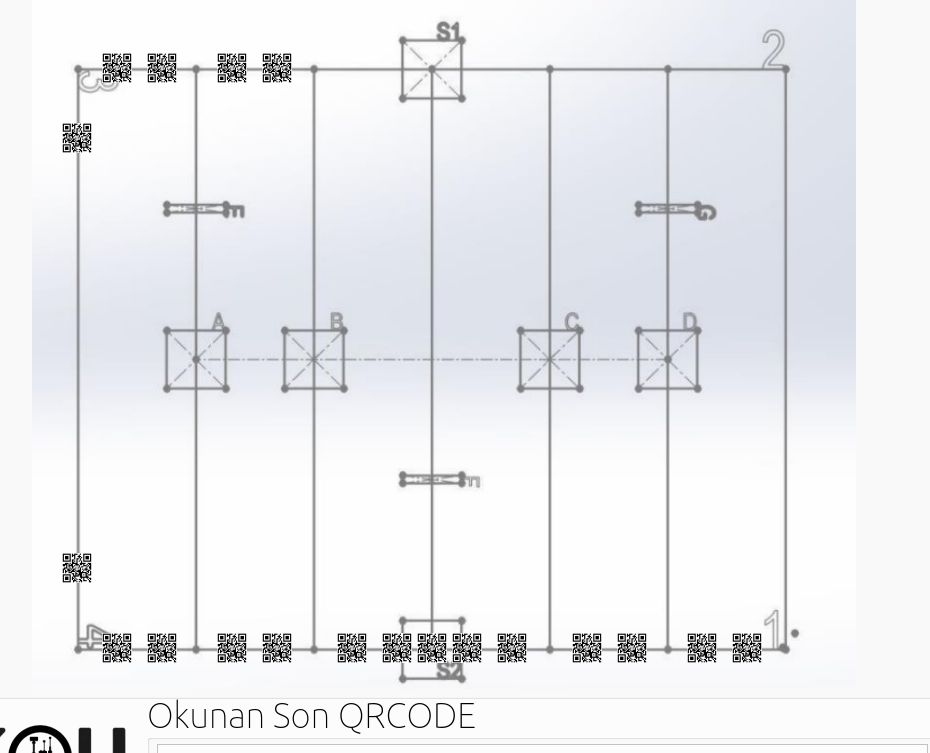
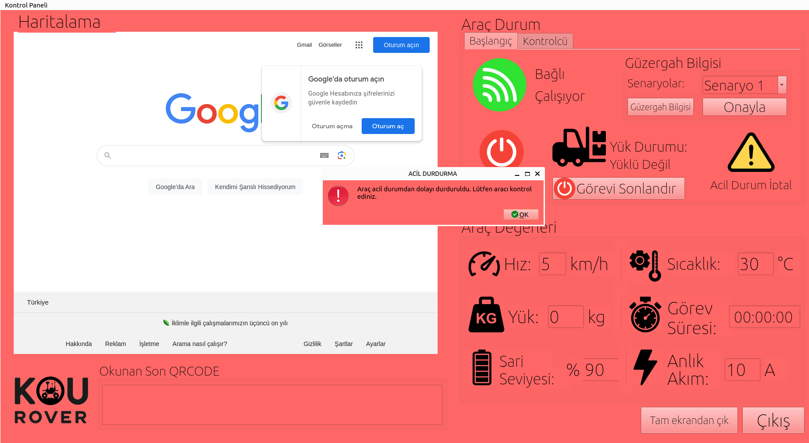
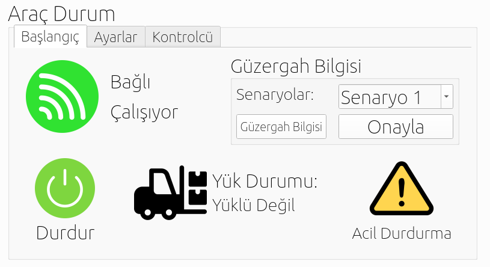
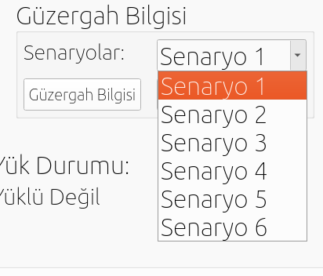
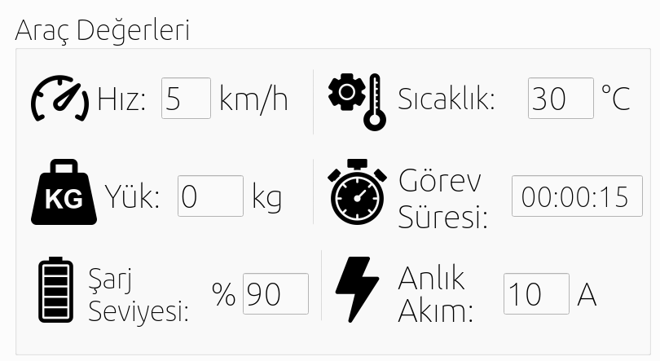

# KOU Rover User Interface System

This project is a visual interface-based control panel developed for the KOU Rover team. Designed to control the AGV (Automated Guided Vehicle) built by KOU Rover, it was developed following the team's first-place achievement in the TEKNOFEST 2024 Industry Digital Technologies Advanced Category competition. The interface works in full integration with the ROS 2 framework and provides real-time monitoring of the robot's status, navigation, and various sensor data throughout its operation. The system also includes advanced features such as QR code reading, load detection, and emergency handling.

## Features

- **ROS 2 Integration:** Communication via topics like `/diff_cont/odom`, `scene_gui`, `gui_start`, `qr_code`, `agirlik_data`.
- **Full Automation Scenarios:** Execute and track tasks through 6 different selectable scenarios.
- **Real-Time Visualization:**
  - Live-updating QR code map
  - Lidar mapping image
- **Remote Control (Turtle Mode):** Control via WASD keys or on-screen buttons.
- **Emergency Handling:** Immediate stop and recovery through the UI.
- **Task Monitoring:** Live tracking of mission time, temperature, speed, load, and battery level.

## Interface Screenshots

Main screen:  


Navigation and control screen:  


QR code map:  


Emergency mode:  


Startup panel:  


Route Information:  


Vehicle Values:  



## Installation

### Requirements

- Ubuntu 20.04+
- Python 3.8+
- ROS 2 (Recommended: Humble)
- `PyQt6`
- `fontconfig`

### Setup

```bash
sudo apt-get install python3-pyqt6 fontconfig
sudo fc-cache -f -v
```

Then install the required Python dependencies inside the project directory:

```bash
pip install -r requirements.txt
```

> **For QR Code Scanner:**  
> Replace `device = evdev.InputDevice("/dev/input/event24")` with the appropriate `event` ID for your system and ensure correct permissions are set (`chmod`, `udev` rules, etc.).

## Running the Interface

```bash
python3 main_rovergui_2_0.py
```

Make sure the required ROS 2 nodes are also running.

## Folder Structure

- `main_rovergui_2_0.py`: Main GUI launcher
- `ros2_nodes/`: ROS publisher/subscriber nodes
- `images/`: Interface icons and QR map visuals
- `web_map.py`: Mapping module
- `guiros.py`: Alternative UI (test version)
- `old_versions/`: Archived versions

## Developer Notes

- `rovergui_2_0.py` contains the logic for QR code updates, button actions, ROS publishers, and connection monitoring.
- PyQt signals are connected using `pyqtSignal(..., Qt.ConnectionType.QueuedConnection)` to ensure thread-safe UI updates.

## License

This project was developed for the TEKNOFEST 2024 Industry Digital Technologies Advanced Category. While it is open-source for educational and personal use, it must not be used in competitions or similar events without permission.
